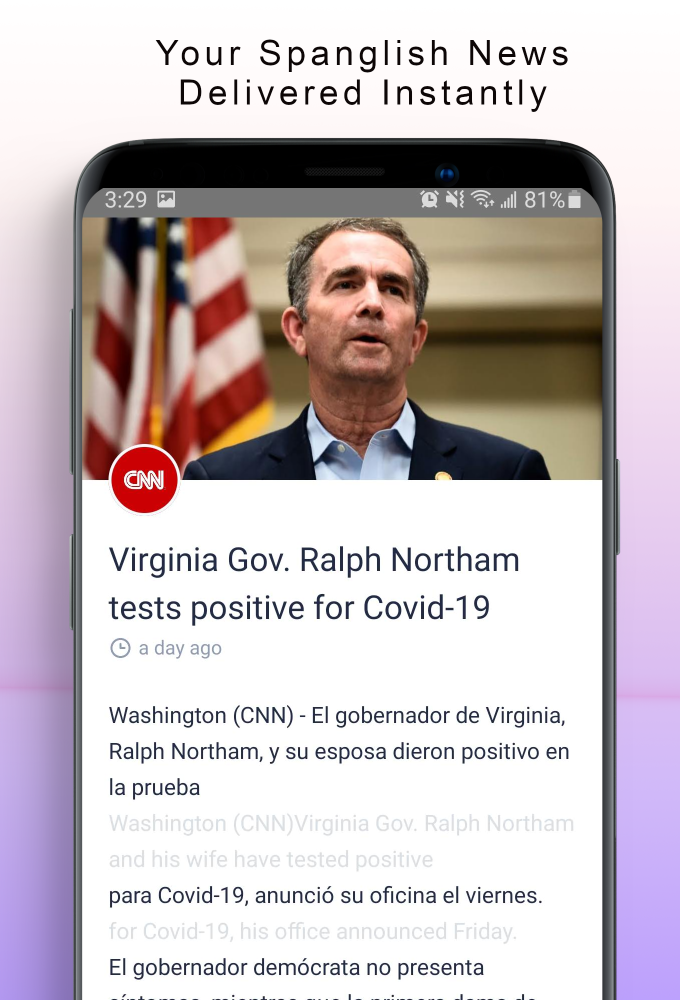

# Spanilla App

 

  
## Latest screenshot

## How to Run Android app locally

-   Install Android Studio
-   Install node (14.x), yarn (1.x)
-   Run Android emulator. (from Android Studio or Genymotion)
-   Run Metro bundler. `yarn start`
-   Run Android app. `yarn android`

## How to Run IOS app locally

-   Install XCode
-   Install node (14.x), yarn (1.x)
-   Run Metro bundler. `yarn start`
-   Install Pod depedencies. `pod install --repo-update`
-   Run Android app. `yarn ios`

## How to Run Detox test on Android Emulator

-   Install detox cli. `yarn global add detox-cli`
-   Build apk for testing. `yarn build-detox-android`
-   Run detox test on apk. `yarn test-detox-android`

## Tips

-   Run `yarn refresh` to reload android app quickly without rebuilding
-   Run `yarn reset` to reset package manager cache
-   Run `adb uninstall com.siristechnology.nepaltodayapp` to uninstall app from the android simulator
-   Run `adb logcat` to view android emulator logs in terminal
